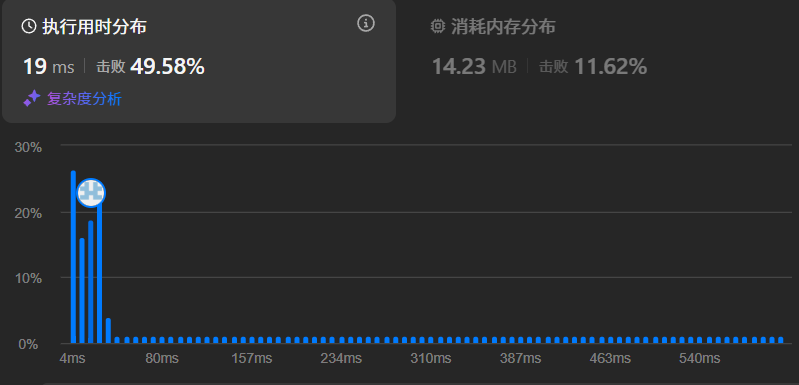
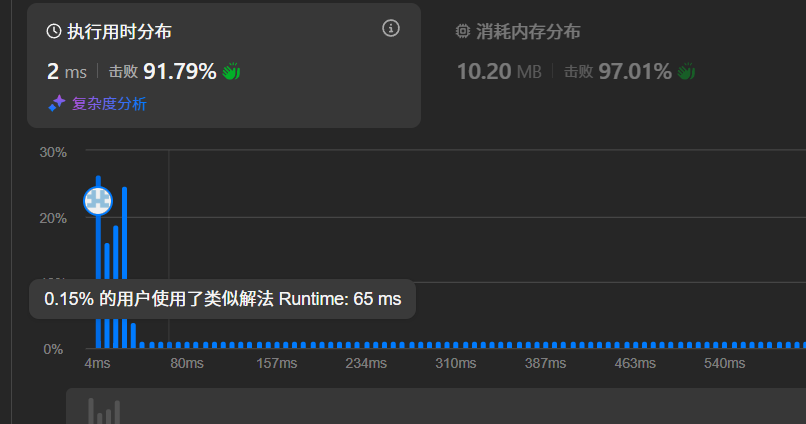

## LeetCode刷题记录：3. 无重复字符的最长子串
### 题目描述

给定一个字符串 s ，请你找出其中不含有重复字符的 最长 子串 的长度。
示例 1:

输入: s = "abcabcbb"
输出: 3 
解释: 因为无重复字符的最长子串是 "abc"，所以其长度为 3。
示例 2:

输入: s = "bbbbb"
输出: 1
解释: 因为无重复字符的最长子串是 "b"，所以其长度为 1。
示例 3:

输入: s = "pwwkew"
输出: 3
解释: 因为无重复字符的最长子串是 "wke"，所以其长度为 3。
     请注意，你的答案必须是 子串 的长度，"pwke" 是一个子序列，不是子串。

### 官方题解
```cpp
class Solution {
public:
    int lengthOfLongestSubstring(string s) {
        int ans = 0, n = s.size();
        if (n < 2) return n;
        unordered_set<char> occ;
        int right = 0;
        for (int i = 0; i < n; ++i) {
            if (i > 0) {
                occ.erase(s[i - 1]);
            }
            while(!occ.count(s[right]) && right < n) {
                occ.emplace(s[right]);
                right++;
            }
            ans = max(ans, right - i);
        }
        return ans;
    }
};
int main() {
    Solution sol;
    string s = "pwwkew";
    int ans = sol.lengthOfLongestSubstring(s);
    cout << "Length of the longest substring without repeating characters: " << ans << endl;
    return 0;
}
```
### 题解分析
这道题是典型的滑动窗口。我们需要构造左右边界进行遍历。通常的方式是遍历左边界，并让右边界在特定条件下向右遍历。
该算法的时间复杂度是O(n), 空间复杂度是O(字符集大小)
我们让right初始和左边界i在同一个位置，这样第一个元素就被放入集合中。
同时进行向右延申右边界，直到出现重复元素。这样就实现了ans 应该是max(ans, right - i)；
如果出现两个字符w的情况，且此时i为后一个w的坐标。那算法会先将w删去，然后由于此时right=i 所以又会将w添加进集合中。
以上是基础的思路，下面对该算法进行优化。
**优化方向**
- 由于unordered_set会有哈希开销。所以常数时间可能会比较大。
- 条件判断逻辑优化（尝试减少判断次数）
- 改变代码结构，使其更清晰
```cpp
class Solution {
public:
    int lengthOfLongestSubstring(string s) {
        int ans = 0;
        unordered_set<char> occ;
        int left = 0, right = 0, n = s.size();
        while (right < n) {
            if (!occ.count(s[right])) {
                occ.insert(s[right++]);
                ans = max(ans, right - left);
            } else {
                occ.erase(s[left++]);
            }
        }
        return ans;
    }
};
int main() {
    Solution sol;
    string s = "pwwkew";
    int ans = sol.lengthOfLongestSubstring(s);
    cout << "Length of the longest substring without repeating characters: " << ans << endl;
    return 0;
}
```
该过程主要提升了算法的可读性，让结构更清晰简单。
我们只要保证right遍历到最后就可以退出循环了，所以用while即可。
接下来如果出现右边界在集合中则让左边界累加并相应从集合中删掉元素。否则，我们就让右边界累加。并计算最大长度。
**进一步的优化**
```cpp
class Solution {
public:
    int lengthOfLongestSubstring(string s) {
        int ans = 0;
        vector<bool> seen(128, false);  // ASCII 字符集
        int left = 0, right = 0, n = s.size();
        
        while (right < n) {
            if (!seen[s[right]]) {
                seen[s[right++]] = true;
                ans = max(ans, right - left);
            } else {
                seen[s[left++]] = false;
            }
        }
        return ans;
    }
};
```
由于题目中加入了这样的条件：`s 由英文字母、数字、符号和空格组成`
**主要优化：由于这些字符属于ASCII码，我们就可以通过建立ASCII码的集合来降低哈希冲突，减少常量时间。** 所以用下面的集合代表ASCII字符集TODO`vector<bool> seen(128, false);`
这样就极大的降低了原本的哈希冲突。同时**数组访问O(1)比哈希更快，且可能会带来更小的空间占用（128bit）**
### 结果展示
***优化前***  
  
***优化后的情况***  

