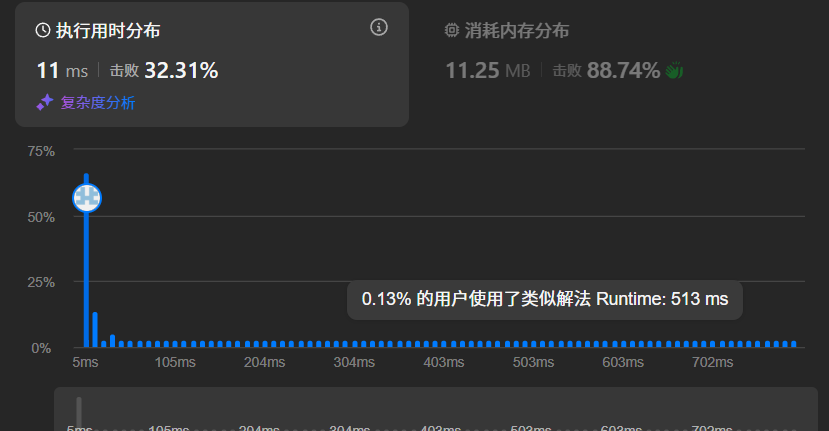

## LeetCode刷题记录：438. 找到字符串中所有字母异位词
### 题目描述
给定两个字符串 s 和 p，找到 s 中所有 p 的 异位词 的子串，返回这些子串的起始索引。不考虑答案输出的顺序。

示例 1:
输入: s = "cbaebabacd", p = "abc"
输出: [0,6]
解释:
起始索引等于 0 的子串是 "cba", 它是 "abc" 的异位词。
起始索引等于 6 的子串是 "bac", 它是 "abc" 的异位词。

示例 2:
输入: s = "abab", p = "ab"
输出: [0,1,2]
解释:
起始索引等于 0 的子串是 "ab", 它是 "ab" 的异位词。
起始索引等于 1 的子串是 "ba", 它是 "ab" 的异位词。
起始索引等于 2 的子串是 "ab", 它是 "ab" 的异位词。

### 官方题解
```cpp
class Solution {
public:
    vector<int> findAnagrams(string s, string p) {
        if (s.size() < p.size()) return vector<int>();
        vector<int> scount(26);
        vector<int> pcount(26);
        vector<int> ans;
        for (int i = 0 ; i < p.size() ; ++i) {
            ++scount[s[i]-'a'];
            ++pcount[p[i]-'a'];
        }
        if (scount == pcount) {
            ans.push_back(0);
        }
        for(int i = 0 ; i < s.size()-p.size() ; ++i) {
            --scount[s[i] - 'a'];
            ++scount[s[i + p.size()] - 'a'];
            if (scount == pcount) {
            ans.push_back(i + 1);
            }
        }
        return ans;
    }
};
```
### 题解分析
这个题解通过vector而非哈希减少了哈希冲突，并降低了常数时间，已经是一个高效的实现。
时间复杂度是O(n), 空间复杂度是O(1)。
通过动态维护两个vector，并进行比较相应字母的数量统计，就可以判断是否为异位词。
### 优化方向
- 在进行vector比较时，每次要对整个数组进行比较，或许可以利用一个变量来统计匹配的词数量，并降低比较次数。
- 在时间复杂度和空间复杂度都不可能进一步优化的前提下，考虑减少判断、访问次数
### 优化代码
```cpp
class Solution {
public:
    vector<int> findAnagrams(string s, string p) {
        if (s.size() < p.size()) return {};
        vector<int> scount(26, 0), pcount(26, 0);
        vector<int> ans;
        int p_len = p.size();
        int match = 0;
        for (char c : p) {
            ++pcount[c - 'a'];
        }
        for (int i = 0; i < p_len; ++i) {
            char c = s[i];
            if (++scount[c - 'a'] <= pcount[c - 'a']) {
                ++match;
            }
        }
        if (match == p_len) {
            ans.push_back(0);
        }
        for (int i = 0; i < s.size() - p_len; ++i) {
            char left_char = s[i];
            if (scount[left_char - 'a']-- <= pcount[left_char - 'a']) {
                --match;
            }
            char right_char = s[i + p_len];
            if (++scount[right_char - 'a'] <= pcount[right_char - 'a']) {
                ++match;
            }
            if (match == p_len) {
                ans.push_back(i + 1);
            }
        }
        return ans;
    }
};
```
最开始通过match记录符合p异位词的字符数量，如果等于p的长度，那一定是匹配的。
接下来对s进行遍历，将窗口左侧的字符如果是符合p异位词的，那在弹出时，要将match降低，并减1。窗口右侧加入的字符类似。
最后通过这种方式，我们消除了原本的对整个vector进行比较的过程，加快了算法运行效率。
### 优化结果
**优化前的结果**

**优化后的结果**

